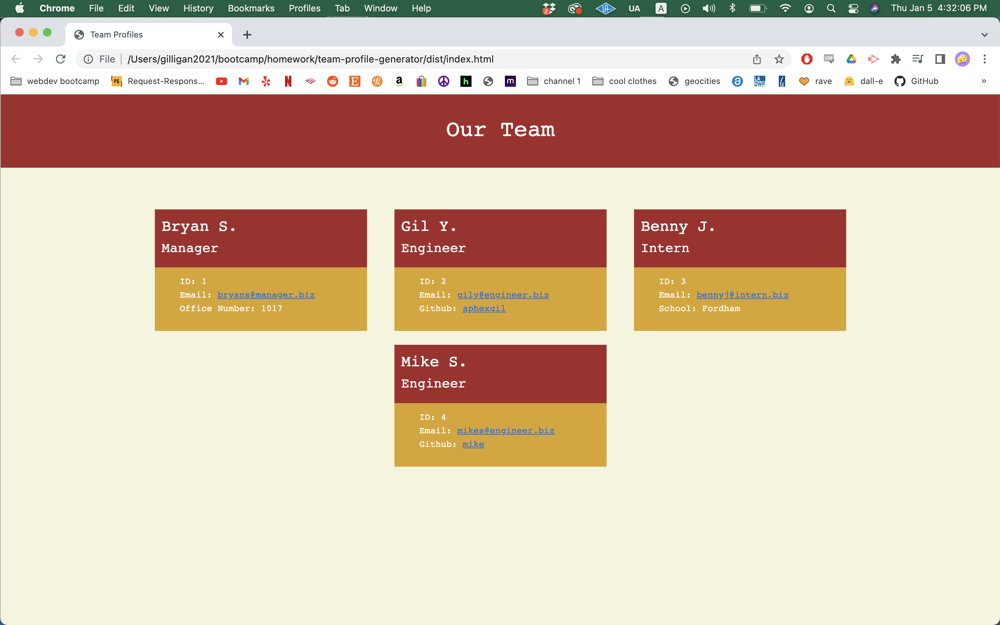

# Team Profile Generator

## Description

A command-line utility which generates an HTML team profile page based on user inputted  information. 

## Table of Contents

- [Image](#image)
- [Video](#video)
- [Installation](#installation)
- [Usage](#usage)
- [License](#license)
- [Testing](#testing)
- [Questions](#questions)

## Image

## Video

Click [here](https://drive.google.com/file/d/1JA7mHqxMRIliG92iHedQVxFBYPt9HyDA/view?usp=sharing) to see a walkthrough video demonstrating project's functionality.

## Installation

Download a copy of the repository from Github. Using the terminal, navigate to the directory 'team-profile-generator' and run 'node index.js' to start the program.

## Usage

Input manager information, followed by information for all engineers and interns, before selecting 'Generate HTML'.

## License

This software is covered under MIT License. To find out more, visit [MIT License](https://opensource.org/licenses/MIT)

## Testing

In the directory 'team-profile-generator', run 'npm test'.

## Questions

If you have any questions, direct them to https://github.com/aphexgil or gil.young.1994@gmail.com.
